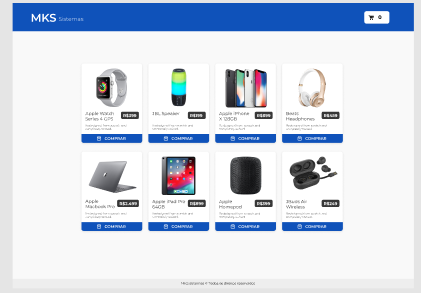
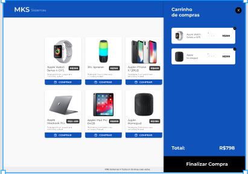

## Getting Started

First, run the development server:

```bash
yarn dev
ev
```

Open [http://localhost:3000](http://localhost:3000) with your browser to see the result.


## Criação de Ecommerce em Next JS

Tecnologias utilizadas:

Next.js
TypeScript
Redux toolkit
Styled-components
Jest
axios


<div align="center">
    
</div>
<br/>

<div align="center">
    
</div>

<br/>

<div align="center">
    
</div>
